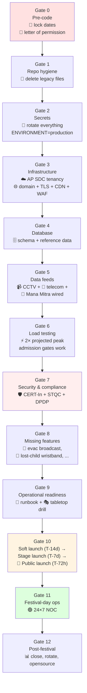
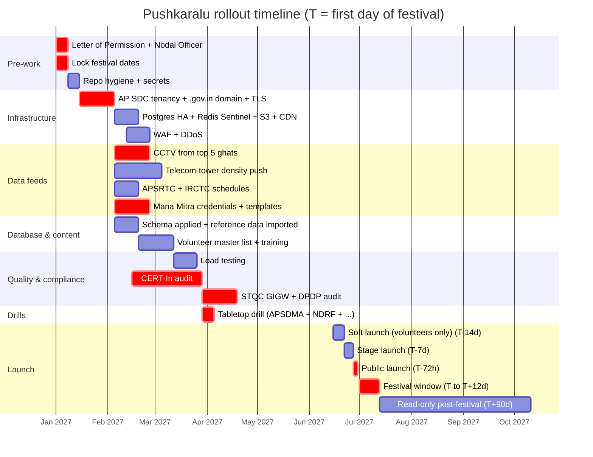

# Godavari Pushkaralu 2027 — Real-World Deployment Checklist

> Step-by-step checklist for taking this codebase from "works on my Render free tier" to "running the actual festival for 1 cr+ pilgrims".
>
> Cross-references:
> - [`SYSTEM_DOCUMENTATION.md`](./SYSTEM_DOCUMENTATION.md) — what the platform does
> - [`GOVERNMENT_REQUIREMENTS.md`](./GOVERNMENT_REQUIREMENTS.md) — what to source from govt

The list is organised as **gates**: each gate must close before the next opens. Treat it like a CI pipeline — do not "skip ahead".

### Visual: the 12 gates



### Visual: rough rollout timeline (assuming festival = T)



> Dates are **illustrative** — replace with real figures once Gate 0 closes.

---

## Gate 0 — Before any code is touched

- [ ] **Lock the festival date window.** Resolve the inconsistency listed in `SYSTEM_DOCUMENTATION.md` §1.1. Update:
  - `README.md` (root + `pushkaralu_fixed/`)
  - `main.py` `/` route `festival_dates` field
  - `chat.py` system prompt
  - `app/core/risk_engine.py` `HIGH_TRAFFIC_DATES`
  - All HTML pages in `dashboards/`
  - All WhatsApp & SMS templates
- [ ] Get the Letter of Permission and Nodal Officer designation. (See Govt Req §0 + §5.1, §5.2.)
- [ ] Decide the canonical ghat list (15 in current sample data; final number from Endowments).

---

## Gate 1 — Repository hygiene

- [ ] Delete the legacy root files now that imports go through `app/core/`:
  - `pushkaralu_fixed/auth.py`
  - `pushkaralu_fixed/pg_store.py`
  - `pushkaralu_fixed/storage.py`
  - `pushkaralu_fixed/fix.py` (one-off migration script, no longer needed)
- [ ] Remove `dashboards/sample_data.json` — the API serves data from `data/sample_data.json`; the dashboard one is dead weight that drifts out of sync.
- [ ] Remove the duplicate `backend/user.html` (also tracked in `DUPLICATE_HTML_WARNING.md`).
- [ ] Add a top-level `LICENSE` file and a `CODE_OF_CONDUCT.md` if releasing under govt open-source policy (recommended: AGPL-3.0 + IndiaGOV exception).


---

## Gate 2 — Secrets and configuration

- [ ] Generate every secret afresh — **none** of the placeholders in `.env.example` should appear in production:
  ```bash
  python -c "import secrets; print(secrets.token_hex(32))"   # JWT_SECRET_KEY
  python -c "import secrets; print(secrets.token_hex(32))"   # ADMIN_API_KEY
  ```
- [ ] Set `ENVIRONMENT=production` so the auth module's fail-fast guard runs (refuses to start with weak secrets).
- [ ] Strong `ADMIN_PASSWORD` (≥ 16 chars, generated, stored in NIC's secret vault — never in a git-tracked `.env`).
- [ ] Strong `POSTGRES_PASSWORD` for the Postgres role.
- [ ] Lock down `CORS_ALLOWED_ORIGINS` to exactly `https://pushkaralu.ap.gov.in` (and the staging URL during test).
- [ ] Set `WHATSAPP_PROVIDER=mana_mitra` once RTGS credentials arrive (mock until then is fine).
- [ ] Enable S3/R2 with a bucket dedicated to the festival; do **not** rely on the local-disk fallback in production.
- [ ] Turn off `--reload` in any uvicorn invocation; in `render.yaml` it's already off.
- [ ] Rotate every secret on day-after-festival as part of the close-down ritual.

---

## Gate 3 — Infrastructure on AP State Data Centre / NIC-MeghRaj

- [ ] 4× API VMs behind an internal load balancer (HAProxy or NIC's managed LB). Each runs the `pushkaralu-api:v8` image.
- [ ] Postgres: HA pair with streaming replication; nightly base backup + WAL archive to NIC SAN.
- [ ] Redis: at least 3-node Sentinel; the leader-election loop already supports this transparently.
- [ ] Object storage bucket with public-read on `/uploads/` and lifecycle rule deleting images > 90 days.
- [ ] CDN in front (NIC content distribution or commercial Cloudflare on govt empanelment).
- [ ] WAF in front (rule-set tuned for OWASP Top-10 + bot manager).
- [ ] DNS: `pushkaralu.ap.gov.in`, `api.pushkaralu.ap.gov.in`, `cdn.pushkaralu.ap.gov.in` with TTL 60 s during festival.
- [ ] TLS certificate from NIC CA, wildcard `*.pushkaralu.ap.gov.in`.
- [ ] HSTS max-age 1 year, preload-list submission after 14 days of clean operation.


---

## Gate 4 — Database readiness

- [ ] `db/schema.sql` applied. Verify with `\dt` — should list `ghats, volunteers, sos_alerts, issues, lost_persons, facilities, transport_routes, emergency_contacts, medical_facilities, crowd_snapshots, app_events`.
- [ ] Authoritative reference data imported (see Govt Req §9): ghats, volunteers, police, hospitals, fire, helplines, hotels, poojas, trains, buses.
- [ ] Trigram extension `pg_trgm` available — used by lost-person fuzzy search.
- [ ] Postgres tuned via `infrastructure/postgres/postgresql.conf`: `shared_buffers = 25%RAM`, `effective_cache_size = 75%RAM`, `max_connections ≥ 200`, `work_mem ≥ 16MB`, `wal_compression = on`.
- [ ] Connection pool: `DB_MIN_POOL=4`, `DB_MAX_POOL=16` per API instance (4 instances × 16 = 64 ≤ 200 max). Adjust if load tests show contention.
- [ ] `pgbouncer` (transaction mode) recommended in front of Postgres if API instances grow > 4.
- [ ] Daily logical backup `pg_dump` to NIC SAN, kept for 30 days; weekly base backup kept 1 year.

---

## Gate 5 — Data feeds wired

- [ ] At least one CCTV stream per ghat is reaching `cctv-worker` and posting to `/crowd/ingest/cctv`.
- [ ] Each camera's `frame_area_sq_m` is **calibrated**, not the default 500. Without this the YOLO head count is meaningless.
- [ ] Telecom tower density push is wired (or explicitly waived in writing by APSDMA).
- [ ] APSRTC + IRCTC schedules are loaded and refreshed daily.
- [ ] River-level / weather feed is wired with a **kill-switch handler** that broadcasts an evacuation message when the threshold is crossed (this is **not yet wired** — pending feature).
- [ ] Mana Mitra (or fallback Twilio) is sending real messages on staging, with all 5 templates approved.
- [ ] NIC SMS gateway is sending real OTPs on staging.

---

## Gate 6 — Load testing

Plan for: peak day 1 cr pilgrims, ~ 300 RPS sustained on `/sos_alert`, `/report_issue`, `/get_ghats`, peak burst 2000 RPS for ~30 s during opening Aarthi.

- [ ] k6 / Locust suite covering:
  - Pilgrim happy path: open user.html → load ghats → tap SOS.
  - 1000 concurrent WebSocket clients with messages every 5 s.
  - 100 RPS on `/report_issue` with 4 MB image uploads.
  - 50 RPS on `/api/chat` (most expensive endpoint).
- [ ] Verify admission gates kick in: at saturation, requests should 503 (with `Retry-After: 2`), **not** 5xx or timeout.
- [ ] Verify the rate-limit fails closed when Redis is killed mid-test (DDoS protection invariant).
- [ ] Run `cctv-worker` against 30 mock streams; verify event-loop lag stays under 100 ms (the `Heal/Loop` guardian's WARN threshold).
- [ ] Postgres p95 query time under 50 ms during the soak test; turn on `pg_stat_statements`.


---

## Gate 7 — Security & compliance

- [ ] CERT-In empanelled auditor engagement signed, 4–6 week black-box + grey-box pen-test.
- [ ] Source-code audit covers: auth (JWT, bcrypt, ADMIN_API_KEY), CSRF on admin endpoints, file-upload MIME validation, SQL/NoSQL injection in `pg_store`, SSRF in scraperbot client, prompt injection in `/api/chat`.
- [ ] All findings closed or risk-accepted in writing before public IP is opened.
- [ ] **PII redaction in logs** — currently `[WA webhook] from=%s` and `[Chat] OK | ip=%s` log raw values. Patch to log `phone_hash[:6]` and `ip_hash[:6]` instead.
- [ ] DPDP-compliant privacy notice rendered in user.html before any pilgrim location is captured.
- [ ] STQC GIGW 3.0 audit: accessibility (WCAG 2.1 AA), bilingual content, mandatory site sections.
- [ ] Cyber Crisis Management Plan (CCMP) document filed with CERT-In.
- [ ] IP allow-list on `/admin/*` (NOC subnet + DevOps VPN).
- [ ] Disable `/docs` and `/redoc` in production (or gate them behind admin key) — they're convenient for attackers too.
- [ ] Test: revoking a volunteer JWT (rotate `JWT_SECRET_KEY`) invalidates all sessions within < 1 minute.

---

## Gate 8 — Features still to add for real-world use

The following are not in the codebase today but are important for a real festival. Tracked here so they don't get forgotten:

- [ ] **Evacuation broadcast** endpoint that takes one ghat (or all) and pushes a `EVAC_ORDER` message to every connected pilgrim WS + WhatsApp + LED boards + PA system. Wired to a kill-switch in admin.html behind a 2-person confirmation.
- [ ] **Lost-child wristband flow**: an RFID/QR endpoint that, on scan, opens a pre-filled lost-child report at the nearest enquiry counter.
- [ ] **Two-factor admin login**: TOTP on top of `/admin/login`. Implementation is small; keep ADMIN_API_KEY as fallback.
- [ ] **One-click ghat closure**: marks a ghat as `closed` and stops the auto-engine from broadcasting "low" once it's closed by police.
- [ ] **Volunteer tracking**: opt-in live location of on-duty volunteers (tab open in their ruggedised tablet) so the SOS dispatcher uses real-time positions, not last-known.
- [ ] **Public-address (PA) integration**: `POST /pa/announce` that translates text → speech (Bhashini) → blasts to PA controllers via SIP/MQTT.
- [ ] **Sponsor / partner CRUD**: APTDC, sponsors, vendors — purely admin-facing.
- [ ] **Bilingual translation pipeline**: integrate Bhashini for Telugu/Hindi auto-translation of admin-typed announcements before WhatsApp send.
- [ ] **Reunification audit ledger**: every "found" status flip on `lost_persons` writes an immutable record (Postgres + signed hash) for legal traceability.
- [ ] **Offline mode for volunteers**: their console works on poor connectivity (service worker + IndexedDB queue, sync on reconnect).


---

## Gate 9 — Operational readiness

- [ ] **Runbook** in this repo under `docs/RUNBOOK.md` (still TODO) covering:
  - "Redis is down" — confirm circuit breaker, watch reconnect loop.
  - "Memory guardian fired CRIT" — collect heap profile, identify hot path, hot-restart.
  - "WhatsApp is bouncing" — switch provider via `WHATSAPP_PROVIDER` env, restart.
  - "CCTV worker shows everything as `mock`" — YOLO model load failure or no GPU; degrade gracefully.
  - "Postgres degraded" — read-only mode is automatic, but verify DB-writer is buffering to `stream:events`.
  - "Surge alert at peak ghat" — operator action: divert pilgrims, broadcast on PA, request police reinforcement.
- [ ] **Tabletop drill** with District Admin, Police, Medical, Fire, NDRF, APSDMA — at least 2 runs:
  1. Stampede simulation at Pushkar Ghat.
  2. Lost-child reunification.
- [ ] On-call rotation defined in PagerDuty (or iGOT-Karmayogi-equivalent).
- [ ] War-room WhatsApp / Signal group with all stakeholders (Nodal Officer, vendor lead, NIC contact, Mana Mitra contact, RTGS contact).
- [ ] Status page (`status.pushkaralu.ap.gov.in`) — even a minimal one.

---

## Gate 10 — Public launch

- [ ] **Soft launch** 14 days before festival: open to volunteers + civic staff only, real data flowing.
- [ ] **Stage launch** 7 days before festival: open to a single pilot district, monitor for 48 h.
- [ ] **Public launch** 72 h before festival.
- [ ] First 24 h after public launch: 4 DevOps engineers on rolling 6-hour shifts, no leave.
- [ ] Daily 11 AM stand-up with Nodal Officer for the entire festival window.

---

## Gate 11 — Festival-day operations

- [ ] Health checks every 30 s into the District NOC monitor wall.
- [ ] Alert channels tested at 4 AM each day before peak bathing (5–8 AM).
- [ ] Manual override fallback: if the platform is partially degraded, pilgrim view falls back to a static helpline page (already auto-served when API returns 503).
- [ ] Daily snapshot: number of SOS, resolved %, missing persons reunited, peak crowd, messages sent. Filed with District Admin every evening.
- [ ] Cyber-incident first responder available within 5 minutes round the clock.

---

## Gate 12 — Post-festival shutdown

- [ ] Open the public site to read-only for 90 days (lost-person closures, post-incident enquiries).
- [ ] Export anonymised aggregate crowd-density data under NDSAP open-data licence.
- [ ] Rotate every secret (JWT, admin key, S3 keys, Redis password).
- [ ] Final security audit + report filed with CERT-In.
- [ ] Hand over a "lessons learned" write-up to APSDMA + Endowments for the next 12-year cycle (Krishna 2028 onwards).
- [ ] Release the codebase upgrades upstream so the next state's Pushkaralu inherits the work.

---

## Single-page TL;DR

If your team only has 5 minutes to plan, do these 12 things in order:

1. Lock the festival dates with Endowments.
2. Get the Letter of Permission from the District Collector.
3. Tenancy on AP State Data Centre + `pushkaralu.ap.gov.in` domain + TLS.
4. Generate every secret afresh; set `ENVIRONMENT=production`.
5. Apply `db/schema.sql`; import authoritative reference data.
6. Wire CCTV from at least 5 ghats and calibrate `frame_area_sq_m`.
7. Get Mana Mitra credentials (or set up Twilio fallback).
8. Pass CERT-In + STQC + DPDP audits.
9. Run a 2-week load test ramping to 2× projected peak.
10. Run two tabletop drills with all emergency services.
11. Soft-launch 14 days before the festival; public-launch 72 h before.
12. After the festival: rotate everything, file a lessons-learned report, open-source the diffs.

Everything else flows from these 12 actions.
