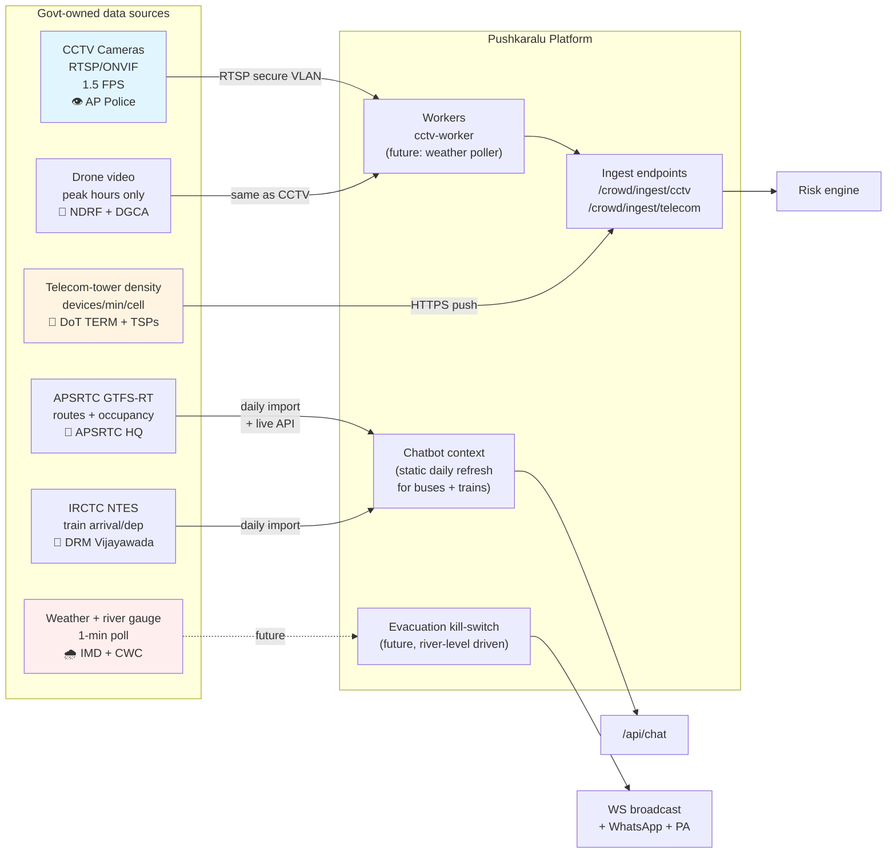
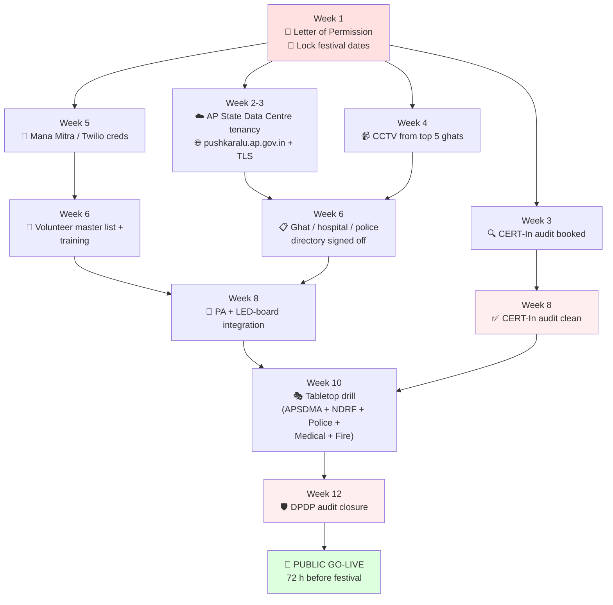

# Godavari Pushkaralu 2027 — Government Requirements & Onboarding Checklist

> The minimum set of **infrastructure, data feeds, API access, approvals, MoUs, hardware and personnel** that must be sourced from the Govt. of Andhra Pradesh (and Govt. of India where noted) before this platform can be used to manage the actual festival.
>
> Use this document to drive meetings with: District Collector East Godavari, SP East Godavari, Endowments Department, APSDMA, RTGS / Mana Mitra, NIC AP, MeitY, AP IT&E Dept., APSRTC, Indian Railways DRM Vijayawada.

---

## 0. The single most important thing to do first

Convene a kickoff meeting with the **District Collector, East Godavari** and the **Endowments / Devasthanam Commissioner** to:

1. Lock the **official festival date window** (currently the codebase has three different ranges).
2. Agree the **list and capacity of every ghat** that will be opened.
3. Designate the **single Nodal Officer** through whom all subsequent integrations are coordinated.
4. Sign a one-page **"Letter of Permission to Build & Pilot"** so vendors of CCTV / SMS / WhatsApp / Telecom can release sandbox keys against an official letterhead.

Until these four things exist, every subsequent ask below will stall at the data-owner department.

### 0.1 Stakeholder map (who owns what)

```mermaid
flowchart TB
    subgraph apex["Apex authority"]
        CM["CM Office / Chief Secretary, AP"]
    end

    subgraph district["District-level (festival operations HQ)"]
        DC["District Collector<br/>East Godavari<br/>(Nodal Officer)"]
        SP["SP East Godavari<br/>(Police + CCTV)"]
        DMHO["DM&HO<br/>(Hospitals + Ambulance)"]
        FIRE["Director Fire Services<br/>East Godavari"]
        END["Endowments<br/>(Ghats + Rituals)"]
    end

    subgraph state["State-level departments"]
        APIT["AP IT&E<br/>Department"]
        APSDMA["APSDMA<br/>(Disaster Mgmt)"]
        RTGS["RTGS<br/>(Mana Mitra)"]
        APSRTC["APSRTC<br/>(Buses)"]
        APTDC["APTDC<br/>(Tourism)"]
        APMAR["AP Maritime Board<br/>(Boats)"]
    end

    subgraph central["Central / GoI"]
        NIC["NIC<br/>(.gov.in + cloud + SMS)"]
        IRCTC["IRCTC + DRM<br/>Vijayawada (SCR)"]
        NDRF["NDRF<br/>+ DGCA (drones)"]
        IMD["IMD + CWC<br/>(weather + river)"]
        UIDAI["UIDAI + DigiLocker<br/>+ ABDM (ABHA)"]
        MEITY["MeitY<br/>(CERT-In + STQC + DPB)"]
    end

    subgraph commercial["Commercial / vendors"]
        TSP["Telecom: Jio /<br/>Airtel / Vi / BSNL"]
        CDN["CDN + WAF vendor"]
        AUDITOR["CERT-In auditor<br/>(empanelled)"]
        VENDOR["Implementation<br/>+ NOC vendor"]
    end

    PLAT["Pushkaralu Platform<br/>(this codebase)"]

    CM -.directs.-> DC
    DC --> SP & DMHO & FIRE & END
    DC -.coordinates.-> APIT & APSDMA & RTGS & APSRTC & APTDC & APMAR

    SP --MoU--> PLAT
    DMHO --MoU--> PLAT
    END --MoU--> PLAT
    APSDMA --MoU--> PLAT
    RTGS --API--> PLAT
    APSRTC --feed--> PLAT
    APIT -.tenancy.-> PLAT

    NIC --hosting + SMS + .gov.in--> PLAT
    IRCTC --feed--> PLAT
    NDRF --drones--> PLAT
    IMD --weather + river--> PLAT
    UIDAI -.optional eKYC.-> PLAT
    MEITY --audits + DPDP--> PLAT
    TSP --tower density--> PLAT
    CDN --edge--> PLAT
    AUDITOR --audit cert--> PLAT
    VENDOR --24x7 ops--> PLAT

    style DC fill:#ffe1e1
    style PLAT fill:#dfd
    style CM fill:#fff4e1
```

---

## 1. Hosting & infrastructure (from Govt. AP / Govt. India)

| # | Item | Owner department | What to ask for | Why |
|---|---|---|---|---|
| 1.1 | **Cloud tenancy on AP State Data Centre** (or NIC-MeghRaj GI Cloud, or AWS GovCloud-equivalent partition reserved for AP IT&E) | AP IT&E Department / NIC AP | At least: 4× general-purpose VMs (4 vCPU / 8 GB) for API, 2× for Postgres HA pair, 2× for Redis Sentinel, 1× GPU VM (NVIDIA T4 or better) for YOLO crowd inference, 1× bastion. Public IP + NICNET dual-homed. | Render's free tier is fine for hackathon demos; a real festival with 1 cr+ pilgrims must run on government-controlled infrastructure for sovereignty, audit, and DDoS protection. |
| 1.2 | **`pushkaralu.ap.gov.in` subdomain** (and `api.pushkaralu.ap.gov.in`) | NIC (.gov.in registrar via APSWAN) | DNS A/AAAA records, ability to publish CAA, set TTL ≤ 5 min for failover | Pilgrim trust + SEO + pre-printed flyers. `.gov.in` is the only domain that pilgrims will trust for SOS. |
| 1.3 | **TLS certificate** (EV or OV) | NIC CA / DigiCert / Sectigo via NIC | Wildcard for `*.pushkaralu.ap.gov.in`, 1-year validity, auto-renew | Required by every modern browser + by Mana Mitra outbound webhook policy. |
| 1.4 | **Object storage** | NIC SAN / Cloudflare R2 (signed by govt) / AWS S3 ap-south-1 | Bucket with public-read ACL on `/uploads/`, 100 GB minimum, CDN in front | Lost-person photos, issue images, evidence. Local-disk fallback is ok for dev only. |
| 1.5 | **CDN** | NIC's content distribution / Cloudflare via empanelment | Global anycast, DDoS protection, image optimization | Festival traffic surges 100× over baseline; CDN absorbs the static-asset load. |
| 1.6 | **WAF + DDoS protection** | NIC's Sanchar Saathi / commercial WAF | Rule set tuned for OWASP Top-10, bot manager, geo-rate-limit | The platform is a soft target during a politically prominent event. |
| 1.7 | **Backup site** (DR) | Mirror tenancy on second NIC region (Hyderabad ↔ Pune) | Async PG replication, weekly restore drill | RPO ≤ 5 min, RTO ≤ 30 min. Required for any system handling a religious gathering of this scale. |
| 1.8 | **24×7 NOC** physical room with 2-person crew | District NOC at Collectorate Kakinada | Power + AC + 4× large monitors + dedicated 100 Mbps fibre + UPS | The admin dashboard is operational only if someone is watching it. |

---

## 2. Real-time data feeds (the heart of the system)

These are the integrations that make the crowd-prediction engine actually predictive instead of cosmetic.

### 2.0 Data-feed ownership at a glance

### 2.1 CCTV camera feeds — **mandatory**
| Item | Detail |
|---|---|
| **Owner** | AP Police (Command & Control Centre, Vijayawada) + East Godavari District Police + AP Industrial Infrastructure Corporation |
| **What to ask for** | RTSP / RTSPS URLs (or ONVIF) for at least **2 cameras per ghat** at the bathing edge, **1 camera at each parking lot**, **1 at each enquiry counter**. Total ~ 60–100 streams. |
| **Resolution** | 1080p preferred; the worker downsamples to 640 px for YOLO anyway, so 720p is acceptable. |
| **Frame rate** | We pull at 1.5 FPS — full motion is wasted for crowd counting. |
| **Network** | A dedicated VLAN from the Police camera network into the AP SDC subnet running `cctv-worker`. The worker MUST be inside the secure network — RTSP over public internet is a non-starter. |
| **Calibration** | For each camera we need the **frame_area_sq_m** — i.e. the ground area covered by the frame in square metres. The risk engine uses this to convert head count into Fruin density. Police GIS team can provide this from existing CCTV survey. |
| **Privacy** | Add a clause to the agreement: head-count only, no face biometrics, frames discarded after inference. Already enforced in code (`cctv_worker.py` does not persist frames anywhere). |
| **Document needed** | MoU with AP Police Cyber Security Wing, signed by SP East Godavari and the Pushkaralu Nodal Officer. |

### 2.2 Telecom-tower density feed — **strongly recommended**
| Item | Detail |
|---|---|
| **Owner** | DoT TERM Cell + each TSP (Jio / Airtel / Vi / BSNL) |
| **What to ask for** | Aggregated unique-device counts per cell tower around each ghat, every 60 s. **No subscriber data, no IMSI, no location traces of individuals** — just counts. Most TSPs have a "smart-city ingestion" endpoint that already does this. |
| **Why** | Vision goes blind in fog, rain, or overnight. Telecom density is weatherproof and gives 30–60 min of advance warning before vision sees the crowd build up at the parking lots. |
| **Tech** | We accept any JSON/CSV push to `POST /crowd/ingest/telecom`. Schema: `{ghat_id, active_devices, tower_baseline, timestamp}`. Existing risk engine will fuse it at 25 % weight. |
| **Document needed** | DPDP-compliant data-sharing agreement with each TSP, countersigned by AP IT&E Department and District Collector. Reference the tower-density precedent set by the Kumbh Mela 2025 control room. |

### 2.3 Drone / UAV feed — **recommended for peak days**
| Item | Detail |
|---|---|
| **Owner** | NDRF + State Police drone unit |
| **What to ask for** | Live video on Maha Pushkar peak hours from at least 2 drones with overlapping coverage of Pushkar Ghat and Goshpada Kshetram. |
| **Integration** | Same `/crowd/ingest/cctv` endpoint, just different `camera_id`. The YOLO worker handles drone frames identically. |
| **Document needed** | DGCA NPNT permission + airspace clearance from AAI Vijayawada. NDRF MoU. |

### 2.4 APSRTC bus schedule + occupancy — **required**
| Item | Detail |
|---|---|
| **Owner** | APSRTC Vijayawada HQ |
| **What to ask for** | Real-time GTFS-Realtime feed (or any JSON) of all special Pushkaralu buses (route, current location, schedule, occupancy). |
| **Why** | Pilgrim chatbot needs to answer "next bus to Pushkar Ghat from Hyderabad". Currently we have static schedules in `sample_data.json`. |
| **Document needed** | Data-sharing MoU with APSRTC. |

### 2.5 Indian Railways train data — **required**
| Item | Detail |
|---|---|
| **Owner** | DRM Vijayawada Division (South Central Railway) + IRCTC |
| **What to ask for** | Static schedule of every train halting at Rajahmundry (RJY) during the window, list of Pushkaralu special trains, real-time arrival/departure if available via the Indian Railways NTES / RailwayAPI feed. |
| **Document needed** | MoU with IRCTC for data-API access (precedent: many state tourism departments have this). |

### 2.6 Weather + River level — **required for safety**
| Item | Detail |
|---|---|
| **Owner** | IMD Hyderabad + Central Water Commission Dowleswaram Barrage office |
| **What to ask for** | 1-minute river gauge at Dowleswaram, hourly rainfall forecast, lightning detection feed |
| **Why** | If discharge from Polavaram / Dowleswaram exceeds threshold, ghats must be evacuated. The platform should auto-broadcast a warning over WhatsApp + WS to every connected pilgrim. (Not yet wired — see DEPLOYMENT_CHECKLIST §7.) |
| **Document needed** | Standard data-sharing letter; CWC has a public API for gauge data. |

---

## 3. Communication channels (from Govt.)

### 3.1 Mana Mitra WhatsApp gateway (preferred over Twilio / Meta direct)
| Item | Detail |
|---|---|
| **Owner** | Real-Time Governance Society (RTGS), AP |
| **What to ask for** | API endpoint URL, API key, sender-ID `PUSHKARALU`, and an **approved template library** for: SOS confirmation, volunteer dispatch, ghat surge alert, lost-person update, helpline broadcast. |
| **Status in code** | Adapter is implemented (`services/whatsapp_service.py::ManaMitraProvider`). Set `WHATSAPP_PROVIDER=mana_mitra`, populate `MANA_MITRA_API_URL` + `MANA_MITRA_API_KEY`. The schema is generic JSON; if RTGS publishes a different schema, only the `ManaMitraProvider.send_text` method changes. |
| **Document needed** | MoU with RTGS + DPDP-compliant template approval from MeitY. WhatsApp templates must be pre-approved by Meta — RTGS has a fast-track lane for state agencies. |

### 3.2 SMS gateway (fallback when WhatsApp not available)
| Item | Detail |
|---|---|
| **Owner** | NIC SMS Gateway (`smsgw.nic.in`) — free for govt usage |
| **What to ask for** | Sender ID `PSHKRA` (DLT-registered), header / template approval for the same 5 message templates |
| **Document needed** | DLT registration via TRAI portal; SMS service request to NIC. |

### 3.3 Helpline 1800-425-0066
| Item | Detail |
|---|---|
| **Owner** | AP State Citizen Call Centre (1100) + District Pushkaralu Helpdesk |
| **What to ask for** | A toll-free number assigned for the festival, mapped to a 50-seat call centre with bilingual operators (Telugu + Hindi + English). Call data exported to the platform via a daily CSV import (existing `app_events` table). |
| **Document needed** | BSNL / Reliance toll-free reservation; vendor contract for call-centre seats. |

---

## 4. Identity & authoritative directories

### 4.1 Volunteer directory
- Source: District Administration Volunteer Cell (existing volunteer scheme used at every Pushkaralu).
- Fields needed: name, mobile, Aadhaar last-4 (for verification only — not stored), zone assignment, blood group, emergency contact.
- Loaded into `volunteers` table via the admin portal CSV upload.

### 4.2 Police-station / Hospital / Fire / Ambulance directory
- Source: SP East Godavari + DM&HO East Godavari + Director of Fire Services AP.
- We already have a curated baseline in `state/emergency_services.py` — needs to be **verified and signed off** by each department before printing on every helpline poster.

### 4.3 Hotel / Choultry / Dharamshala directory
- Source: AP Tourism Department (APTDC) + Pushkar Choultry Council.
- Used to answer "where can I stay" via the chatbot.

### 4.4 Aadhaar / DigiLocker integration (optional, recommended for lost persons)
| Item | Detail |
|---|---|
| **Owner** | UIDAI + DigiLocker (MeitY) |
| **What to ask for** | Aadhaar offline-eKYC (XML zip) + DigiLocker pull for ID proof when registering a missing person. We do **not** want online auth/biometric — too risky and DPDP-heavy. Offline eKYC is sufficient. |
| **Why** | When reuniting a child with parents, we need a legally defensible proof of identity. |
| **Document needed** | UIDAI sub-AUA approval (via APIT&E as the AUA), DigiLocker integration request. |

### 4.5 ABHA (Ayushman Bharat Health Account)
- For pilgrims who collapse with cardiac events, an ABHA-linked record lets the on-site medical camp pull the patient's history.
- Optional but recommended; integration goes through ABDM Sandbox (free for govt).

---

## 5. Permissions / approvals / MoUs you must collect

| # | Document | Counterparty | Why |
|---|---|---|---|
| 5.1 | **Letter of Permission to Build & Pilot** | District Collector, East Godavari | Master umbrella authorisation that every other vendor will demand to see |
| 5.2 | **Designation of Nodal Officer order** | District Collector | Single point of contact for every subsequent integration |
| 5.3 | **MoU with AP Police (Cyber Security Wing)** | SP East Godavari | CCTV access + drone feed + on-ground volunteer dispatch |
| 5.4 | **MoU with APSDMA** | AP State Disaster Management Authority | Crisis communication protocol; the platform's `SURGE_ALERT` must be wired into APSDMA's existing SOP |
| 5.5 | **MoU with DM&HO East Godavari** | District Medical & Health Officer | Medical camps directory + ambulance dispatch SLA |
| 5.6 | **MoU with Endowments Department** | Commissioner, Endowments | Authority over ghats, rituals, pooja schedule, religious authority during festival |
| 5.7 | **MoU with RTGS Mana Mitra** | CEO, RTGS | WhatsApp gateway access |
| 5.8 | **MoU with APSRTC** | MD, APSRTC | Bus schedule + occupancy feed |
| 5.9 | **MoU with IRCTC / SCR DRM Vijayawada** | DRM Vijayawada | Train arrival/departure feed |
| 5.10 | **DPDP Consent Manager registration** | DPB (Data Protection Board, MeitY) | Required before collecting pilgrim phone numbers |
| 5.11 | **Cyber Crisis Management Plan (CCMP)** | CERT-In | Mandatory for any govt-facing public-facing service |
| 5.12 | **CERT-In Security Audit Certificate** | One of the 150+ CERT-In empanelled auditors | Black-box pen-test + source-code audit; must be passed before public IP is opened |
| 5.13 | **STQC GIGW certification** | STQC, MeitY | Accessibility (WCAG 2.1 AA), usability, performance for `.gov.in` sites |
| 5.14 | **DGCA NPNT permission** (for drone footage) | DGCA | If any drone is overhead during festival hours |
| 5.15 | **Bhuvan / NRSC Geospatial layer permission** | NRSC ISRO | If you overlay satellite imagery on the pilgrim map |
| 5.16 | **Rights & Permissions for AI use** | MeitY's IndiaAI mission | If using IndiaAI compute or Bhashini for translation |

---

## 6. Personnel + control-room

| Role | Headcount | Source |
|---|---|---|
| **Nodal Officer** (decisions) | 1 | District Admin |
| **Control-room operators** (3 shifts × 4 = 12, watching admin dashboard) | 12 | District Admin / contracted |
| **Police liaison in NOC** | 1 / shift | SP East Godavari |
| **Medical liaison in NOC** | 1 / shift | DM&HO |
| **Bilingual call-centre agents** (Telugu + Hindi + English) | 50 | Empanelled vendor |
| **Ground volunteers** (already in scope) | 1000–5000 | Volunteer cell |
| **DevOps on-call** (24×7 during festival) | 2 / shift | Vendor team |
| **Content moderator** (review reported issues, suspend abuse) | 4 (across shifts) | Vendor team |
| **Cyber-incident first responder** | 1 / shift | NIC AP CERT-In team |

---

## 7. Hardware that must be procured / sourced

| Item | Quantity | Owner / Source |
|---|---|---|
| Pan-tilt-zoom CCTV cameras at ghats | 30+ | AP Police existing inventory + new procurement |
| Edge inference node (Jetson Orin Nano or similar) at each ghat — **strongly recommended over centralised CCTV worker** | 15+ | New procurement; bring up under the Smart City framework |
| Public-address speakers integrated with the platform's broadcast endpoint | 60+ | District Admin |
| LED display boards at parking lots showing live ghat crowd levels (HTML widget can drive these via WS) | 8 | District Admin |
| Wi-Fi + 4G/5G hotspots at every enquiry counter | 30+ | BSNL / Jio Smart-City package |
| Ruggedised tablets for volunteers (running the volunteer console) | ~500 | District Admin / sponsorship |
| Power-banks / charging stations near ghats | 30+ | Sponsorship |
| Digital wristbands for children (RFID/NFC, used for lost-child reunification) | 100k | New procurement; integrates via QR-code endpoint we still need to add (see DEPLOYMENT_CHECKLIST §8) |

---

## 8. Connectivity & networking

| Item | Detail |
|---|---|
| Fibre to NOC | Dedicated 100 Mbps from BSNL or NICNET, separate from CCTV VLAN |
| Bandwidth at each ghat | Min 50 Mbps up for camera streams; 4G/5G failover acceptable |
| IPSec VPN between AP SDC and the District NOC | Required so admin staff can VPN in if the public site goes down |
| NTP from NIC's stratum-1 servers | All servers must time-sync; the rate-limit Lua script is timestamp-based |
| Public IP allow-list on `/admin/*` | Only the District NOC subnet + DevOps VPN egress |

---

## 9. Datasets to provide (one-time imports)

These are static-ish reference data that get loaded once into Postgres before go-live. We currently ship `data/sample_data.json` with placeholder values; the real values must come from the listed owners.

| Dataset | Owner | File format we accept | Cardinality |
|---|---|---|---|
| Authoritative ghat list with capacity, GPS, bathing timings, special dates | Endowments + District Admin | JSON / CSV / Excel | ~30 |
| Volunteer master list | Volunteer Cell | CSV (name, phone, zone, blood group) | 1k–5k |
| Police stations + jurisdictions | SP East Godavari | CSV with lat/lon | ~20 |
| Hospitals, PHCs, mobile medical units | DM&HO | CSV | ~30 |
| Fire stations | Director of Fire Services AP | CSV | 5–10 |
| Helpline numbers (toll-free, district) | District PRO | CSV | 30–50 |
| Hotels / dharmasalas with star rating + price | AP Tourism (APTDC) | CSV | 200–500 |
| Pooja vendors / ritual schedule | Endowments | CSV | 50–100 |
| Train schedule (special + regular halting at RJY) | DRM Vijayawada | CSV / GTFS | ~150 |
| Bus routes (special + regular) | APSRTC | CSV / GTFS | ~100 |
| Boat / ferry routes (Antarvedi etc.) | AP Maritime Board | CSV | 5 |
| Geo-fence polygons of every ghat zone (GeoJSON) | District GIS Cell | GeoJSON | ~30 |
| Geofenced parking-lot polygons | District Admin | GeoJSON | ~10 |
| Map basemap tiles | Bhuvan-NRSC or OSM | XYZ tile URL | 1 |

---

## 10. Compliance & legal

| Item | Owner | Status / Action |
|---|---|---|
| **DPDP Act 2023 compliance** | DPB / MeitY | Privacy notice, consent capture before SOS, lawful-basis statement, retention policy ≤ festival + 90 days |
| **Privacy policy** + **Terms of use** | Project legal | Drafted in Telugu + English, published at `/privacy` and `/terms` |
| **Children's data**: lost-child registration | DPB / NCPCR | Parental consent, no facial biometrics, photos auto-blurred after reunion |
| **WCAG 2.1 AA accessibility** | STQC | Audit before public launch; chatbot screen-reader compatible |
| **GIGW 3.0 compliance** | STQC | Mandatory for `.gov.in` sites |
| **Information disclosure under RTI** | District PIO | Audit logs in `app_events` are RTI-eligible; redact PII before disclosure |
| **Open Data licence (NDSAP)** | DST / MeitY | Aggregate crowd-density data should be opened up after festival ends |
| **Insurance** | Govt. or vendor | Cyber-liability + professional indemnity for the implementing vendor |

---

## 11. Money / commercial

These are not "asked for from govt" but you'll need budget approval through District Admin under the Pushkaralu head:

| Line item | Indicative annual cost (INR) |
|---|---|
| Cloud (AP SDC tenancy, even at govt rates) | 20–40 lakh |
| CDN + WAF (commercial) | 5–10 lakh |
| WhatsApp template fees (Meta business) | 2–5 lakh |
| SMS (NIC SMS is free; commercial fallback) | 0–2 lakh |
| CERT-In audit | 5–8 lakh |
| Object storage + image moderation API | 1–3 lakh |
| GPU compute for YOLO (if not edge) | 5–10 lakh |
| Vendor team salaries (24×7 NOC, 2 months) | 30–60 lakh |
| Insurance | 2–5 lakh |
| Hardware (drones, edge nodes, tablets) | 50 lakh – 1 cr |
| Training / drills | 5 lakh |
| **Indicative total** | **₹ 1.5 cr – 3 cr** |

(All figures are rough planning numbers — must be replaced with actual vendor quotes before financial concurrence.)

---

## 12. Single-page summary — the critical path

If everything else above is delayed, **these eleven items are the minimum viable rollout** for using this platform at the festival:

1. Letter of Permission from District Collector — week 1.
2. Lock the festival date window with Endowments — week 1.
3. AP State Data Centre tenancy + `pushkaralu.ap.gov.in` domain + TLS cert — week 2–3.
4. CERT-In security audit booked — week 3, completed by week 8.
5. CCTV RTSP from at least the 5 highest-traffic ghats — week 4.
6. Mana Mitra API credentials (or Twilio fallback) — week 5.
7. Volunteer master list imported, all volunteers trained on the console — week 6.
8. Authoritative ghat / hospital / police directory imported and signed off — week 6.
9. Public-address + LED-board integration tested — week 8.
10. Tabletop disaster drill with APSDMA, NDRF, Police, Medical, Fire — week 10.
11. CERT-In audit clean closure + DPDP audit closure — **mandatory before opening the public IP**, week 12.

Then go live, and run the platform for the entire festival window plus 90 days for incident closure & analytics.
