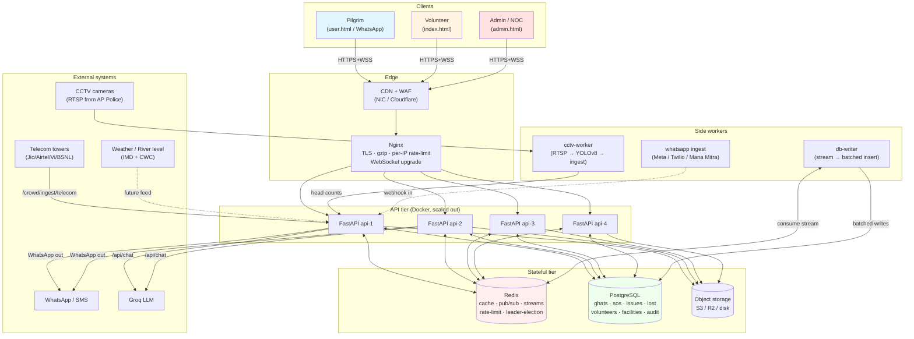
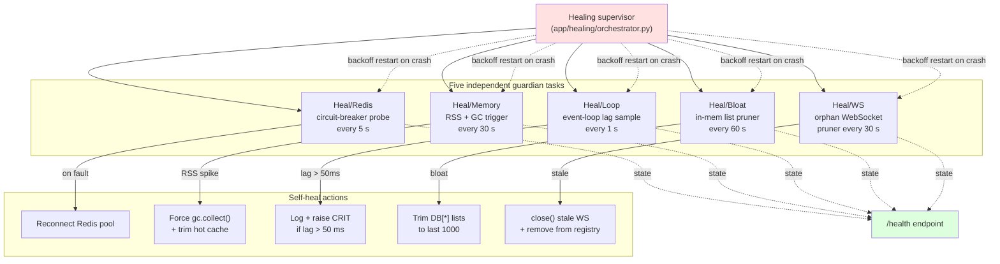
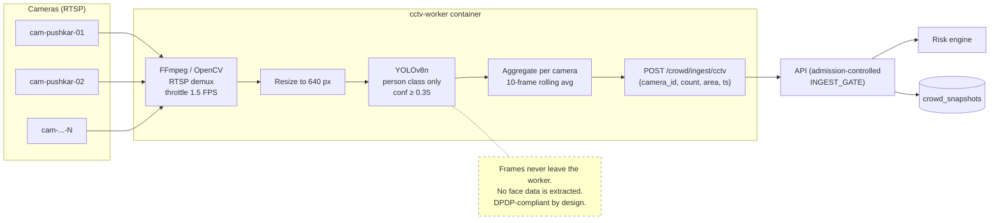
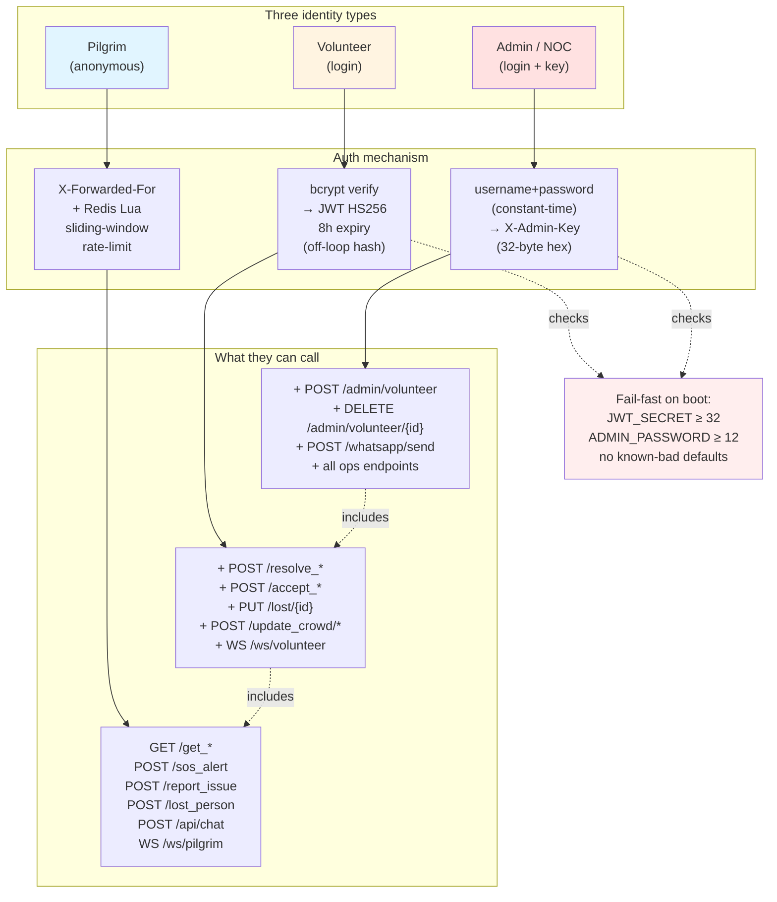
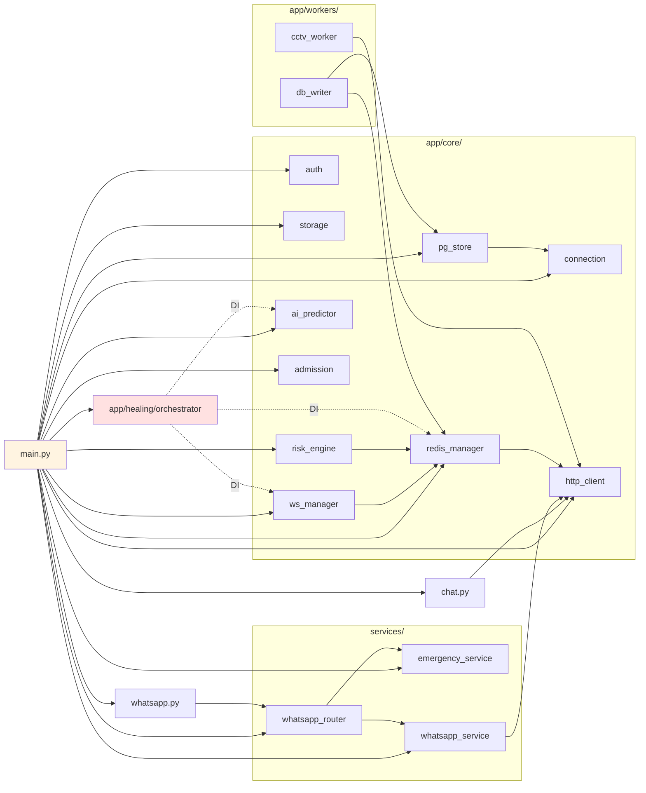

# Godavari Pushkaralu 2027 — System Documentation

> Real-time crowd management, SOS, emergency response, and pilgrim assistance platform for the Godavari Pushkaralu festival, Rajamahendravaram (Rajahmundry), Andhra Pradesh.

---

## 1. Executive summary

| Item | Value |
|---|---|
| Project | Godavari Pushkaralu 2027 Crowd & Emergency Platform |
| Owner (target) | Govt. of Andhra Pradesh — District Administration, East Godavari |
| Festival window | **TBD — see §1.1 below; current code has 3 different date ranges** |
| Geographic scope | Rajamahendravaram, Kovvur, Dowleswaram, Pattiseema, Antarvedi, and surrounding villages |
| Primary users | Pilgrims, Volunteers, Police / Medical / Civic staff, District Admin |
| Primary languages | English, Telugu, Hindi |
| Code version (current) | API v8.0 / Healing v11 / WhatsApp v1 |

### 1.1 Festival date inconsistency — must be resolved before go-live

The codebase currently has **three** different date ranges, which is a blocker for printing tickets, SMS templates, signage, etc. These must all be unified to whatever the Endowments Department / Devasthanam officially gazettes for the 2027 Maha Pushkaram.

| File | Date range used |
|---|---|
| `README.md` (root + project) | July 11 – 22, 2027 |
| `main.py` `/` root response | July 11 – 22, 2027 |
| `chat.py` system prompt | June 26 – July 7, 2027 |
| `app/core/risk_engine.py` `HIGH_TRAFFIC_DATES` | July 25 – 26, 29 – 30 and Aug 3 – 4, 2027 |

**Action:** lock the official window and grep-replace all three. (See `DEPLOYMENT_CHECKLIST.md` §0.)

---

## 2. What the system does (feature inventory)

### 2.1 Pilgrim-facing features (`user.html` and WhatsApp)
- Live crowd-level map (15 ghats, colour-coded green / amber / red / purple)
- One-tap SOS with live location → automatic nearest-volunteer dispatch
- Issue reporting (open toilets, water shortage, lost item, hazard) with photo upload
- Lost-person registration with photo, fuzzy-name search, contact details
- Emergency helplines (Police 100, Ambulance 108, Fire 101, NDRF 1916, Pushkaralu Helpline 1800-425-0066)
- Nearest-help locator (police, hospital, ghat) using haversine distance
- Multi-language AI chatbot (TourGO Pushkara AI, powered by Groq Llama-3.3-70B with Llama-3.1-8B fallback)
- WhatsApp bot covering: SOS, GHATS, GHAT &lt;name&gt;, NEAREST, HELPLINE, LOST &lt;details&gt;, free-form chat
- Off-topic guard: AI refuses anything outside Pushkaralu scope, in user's language

### 2.2 Volunteer features (`index.html`)
- JWT login (8-hour token, bcrypt password hash, fail-fast on weak secrets)
- Real-time SOS feed via WebSocket (partitioned per ghat, heartbeat, orphan pruning)
- Accept / resolve / reassign SOS alerts
- Accept / resolve issues
- Update lost-person status (`missing` → `found` / `closed`)
- Status toggle (`available` / `busy` / `offline`)
- Per-zone assignment

### 2.3 Admin / Command-and-Control features (`admin.html`)
- Dashboard with live counts: active SOS, pending issues, missing persons, high-risk ghats
- CRUD on volunteers, emergency contacts, medical facilities
- Manual crowd-level override per ghat (5-minute lock so the auto-engine does not overwrite an operator decision)
- Audit log via `app_events` Postgres table
- WhatsApp send & simulate endpoints
- Self-healing health summary (`/health` exposes guardian state)

### 2.4 Core engine features
- **Physics-based risk engine** — O(1) computation, no ML, no GPU. Fuses CCTV vision (YOLO head count), telecom tower density, and DB occupancy with weights `0.75 vision + 0.25 telecom`, falls back gracefully when sources are stale.
- **Adaptive thresholds** — on gazetted Maha Pushkar / Ardha Pushkar dates, "medium" and "high" trigger ~15 % earlier so warnings fire sooner on peak days.
- **Surge detector** — ring buffer per ghat detects 20 %+ density jumps within 3 readings, emits `SURGE_ALERT`.
- **Self-healing orchestrator** — five independent guardian loops (Redis, memory, event-loop lag, in-memory list bloat, WebSocket orphan pruning), each supervised with exponential-backoff restart.
- **Admission-control gates** — bounded async semaphores around SOS / report / lost / chat / ingest endpoints so a 1000-RPS spike does not exhaust the Postgres pool.
- **Leader election** — Redis-backed, ensures only one API instance runs the crowd-broadcast loop at a time.
- **Multi-instance state sync** — Redis pub/sub fans every mutation across all 4 API replicas; in-memory hot-cache stays consistent.

---

## 3. Architecture

### 3.1 High-level diagram



### 3.2 Process model

| Container | Purpose | Replicas | CPU | Memory |
|---|---|---|---|---|
| `api-1..N` | FastAPI app, WebSockets, business logic | 4 (default) | 1.0 | 896 MB |
| `nginx` | Edge TLS + rate limit + WS upgrade | 1 | — | — |
| `redis` | Cache, pub/sub, streams, rate-limit, leader | 1 (production: cluster) | — | 2 GB max |
| `postgres` | Source of truth | 1 (production: HA primary + replica) | — | — |
| `db-writer` | Batched writes from `stream:events` | 1 | — | 256 MB |
| `cctv-worker` | YOLOv8 head count per camera | 1 (or 1-per-camera-cluster) | — | 1 GB+ |

### 3.3 Tech stack

| Layer | Choice | Why |
|---|---|---|
| API framework | FastAPI 0.111 | Native async, OpenAPI docs free, type-safe |
| Runtime | Python 3.11+ | asyncio + ZoneInfo + asyncio.to_thread |
| Database | PostgreSQL 15 | ACID + JSONB + pg_trgm fuzzy search + UUIDs |
| Cache / Realtime | Redis 7 | Pub/Sub, Streams, Lua scripted rate-limit, ZADD |
| Reverse proxy | Nginx 1.25 | Rate-limit per `X-Forwarded-For`, WS upgrade |
| Auth | python-jose JWT + passlib bcrypt | HS256, 8h expiry, off-loop hashing |
| Object storage | aioboto3 (S3 / Cloudflare R2) | async multipart, public-read URLs |
| Vision | Ultralytics YOLOv8n | CPU-friendly head count, 640px frames @ 1.5 FPS |
| AI chatbot | Groq Llama-3.3-70B + 8B fallback | Free tier, very low latency |
| WhatsApp | Twilio / Meta Cloud / Mana Mitra (AP Govt) / mock | Provider-agnostic adapter |
| Frontend | Plain HTML / vanilla JS, no build step | Operates from any browser, easy to host |
| Container | Docker + Compose v3.9 | Reproducible local + Render deploy |
| Hosting (default) | Render.com via `render.yaml` | Free Postgres + Redis Starter |

### 3.4 Data flow — SOS alert (the most critical path)

```mermaid
sequenceDiagram
    autonumber
    actor Pilgrim
    participant Nginx
    participant FastAPI as FastAPI<br/>(any of api-1..N)
    participant Gate as SOS_GATE<br/>(admission control)
    participant PG as PostgreSQL
    participant Redis as Redis<br/>(pub/sub + stream)
    participant Peers as Other API<br/>replicas
    participant DBW as db-writer
    participant WA as WhatsApp<br/>provider
    participant V as Volunteer<br/>dashboard

    Pilgrim->>Nginx: POST /sos_alert<br/>{name, phone, lat, lon, photo?}
    Nginx->>Nginx: rate-limit per X-Forwarded-For<br/>(10/min, burst 5)
    Nginx->>FastAPI: forwarded
    FastAPI->>Gate: acquire slot (32 in-flight, 16 waiters)
    Gate-->>FastAPI: ok (or 503 Retry-After)
    FastAPI->>PG: INSERT sos_alerts (status='pending')
    PG-->>FastAPI: alert_id
    FastAPI->>PG: SELECT nearest available volunteer<br/>(haversine on volunteers.lat/lon)
    PG-->>FastAPI: volunteer row
    FastAPI->>Redis: PUBLISH cache:invalidate sos:active
    FastAPI->>Redis: PUBLISH SOS_ALERT
    Redis-->>Peers: fan-out
    Peers->>V: WS push (volunteer dashboards)
    FastAPI->>Redis: XADD stream:events {type:SOS,...}
    Redis-->>DBW: stream item
    DBW->>PG: batched INSERT app_events
    par fire-and-forget
        FastAPI->>WA: send "you have been assigned"
    and primary response
        FastAPI-->>Pilgrim: 200 {volunteer_name, volunteer_phone, eta}
    end

    Note over FastAPI,V: p50 budget &lt; 600 ms<br/>p99 (WA degraded) &lt; 1.2 s
```

**Step-by-step narrative:**
1. Pilgrim taps SOS in `user.html` (or sends "SOS" via WhatsApp).
2. Browser POSTs `/sos_alert` with name, phone, lat/lon, optional photo.
3. Nginx applies SOS rate-limit (10 req/min per IP, burst 5, no nodelay).
4. FastAPI enters the `SOS_GATE` admission-control slot (32 in-flight, 16 waiters, 750 ms wait).
5. Handler writes alert to Postgres via `pg_store.write_sos_alert(...)`.
6. Handler picks the nearest available volunteer using haversine on `volunteers.lat/lon`.
7. Handler invalidates `cache:sos:active`, broadcasts `SOS_ALERT` over Redis pub/sub.
8. All 4 API replicas receive the broadcast and forward over local WebSockets to volunteer dashboards.
9. Handler appends to `stream:events` for the `db-writer` worker (audit trail) and (best-effort) sends WhatsApp to the assigned volunteer.
10. Pilgrim's browser receives a 200 with the assigned volunteer's name + phone.

End-to-end p50 budget: **&lt; 600 ms** including WhatsApp send. p99 (WhatsApp degraded): **&lt; 1.2 s** because the WhatsApp send is fire-and-forget bounded.

---

## 4. Code layout

```
pushkaralu_fixed/
├── main.py                       # FastAPI app + every HTTP route
├── chat.py                       # Groq-backed AI chatbot router
├── whatsapp.py                   # WhatsApp webhook + send + simulate
├── auth.py / pg_store.py / storage.py     # legacy root copies — DO NOT IMPORT
├── app/
│   ├── core/
│   │   ├── auth.py               # JWT + bcrypt + fail-fast secret check
│   │   ├── pg_store.py           # async Postgres CRUD via asyncpg
│   │   ├── storage.py            # S3 / R2 / disk image upload
│   │   ├── redis_manager.py      # Pool, circuit breaker, pub/sub, streams,
│   │   │                         #   Lua rate-limit, crowd history
│   │   ├── ws_manager.py         # WebSocket sharded by ghat, heartbeat,
│   │   │                         #   orphan pruning, Redis bridge
│   │   ├── risk_engine.py        # Physics fusion + adaptive thresholds
│   │   │                         #   + surge detector
│   │   ├── ai_predictor.py       # RSS / loop-lag / thread monitor
│   │   ├── admission.py          # Bounded gates + thread pool +
│   │   │                         #   gather_bounded
│   │   ├── connection.py         # asyncpg pool helpers
│   │   └── http_client.py        # Singleton httpx clients (groq, twilio,
│   │                             #   meta, scraperbot, cctv ingest)
│   ├── healing/
│   │   └── orchestrator.py       # 5 guardian loops + DI accessors
│   └── workers/
│       ├── db_writer.py          # Batched stream → Postgres
│       └── cctv_worker.py        # RTSP → YOLOv8 → API ingest
├── services/
│   ├── emergency_service.py      # Find nearest hospital/police/fire
│   ├── whatsapp_service.py       # Provider-agnostic outbound layer
│   └── whatsapp_router.py        # Intent parsing + dispatch
├── state/
│   └── emergency_services.py     # Static helplines + located services
├── utils/
│   └── location_utils.py         # haversine + nearest_in_list
├── data/
│   └── sample_data.json          # 15 ghats + 100+ facilities + …
├── db/
│   └── schema.sql                # PostgreSQL schema (auto-applied)
├── dashboards/
│   ├── user.html                 # Pilgrim PWA
│   ├── index.html                # Volunteer login + console
│   └── admin.html                # Command + control
├── infrastructure/
│   ├── nginx/nginx.conf          # Edge config (real client IP, rate, WS)
│   └── postgres/postgresql.conf  # Tuned PG config
├── backend/
│   ├── Dockerfile                # API image
│   └── Dockerfile.worker         # Worker image (no YOLO in API image)
├── docker-compose.yml            # Full local stack
├── render.yaml                   # Render.com deploy descriptor
├── requirements.txt
├── .env.example                  # Production-grade env template
├── README.md
├── SETUP_MANUAL.md
└── docs/
    ├── SYSTEM_DOCUMENTATION.md   # ← this file
    ├── GOVERNMENT_REQUIREMENTS.md
    └── DEPLOYMENT_CHECKLIST.md
```

> The three root-level files `auth.py`, `pg_store.py`, `storage.py` are leftovers; the canonical versions live in `app/core/`. They should be deleted before rollout (see `DEPLOYMENT_CHECKLIST.md` §11).

---

## 5. Data model (PostgreSQL)

All schemas in `db/schema.sql`, applied automatically by the Postgres container on first boot.

| Table | Rows expected at peak | Indexes | Purpose |
|---|---|---|---|
| `ghats` | ~30 (one per bathing point) | PK | Reference data, rarely written |
| `volunteers` | 1k – 10k | PK, `idx_volunteers_status` | Login + dispatch |
| `sos_alerts` | up to 50k / day on peak | PK, status, created_at desc | Live & resolved alerts |
| `issues` | up to 100k / day | PK, status, created_at, category | Pilgrim-reported issues |
| `lost_persons` | up to 5k / festival | PK, status, **GIN trigram on name** | Fuzzy name search |
| `facilities` | ~2k | type, ghat_id | Toilets, food, parking, hotels |
| `transport_routes` | ~500 | type | Trains, buses, boats, shuttles |
| `emergency_contacts` | ~500 | category | Phone directory |
| `medical_facilities` | ~100 | type | Hospitals, first-aid camps |
| `crowd_snapshots` | hundreds of millions | (ghat_id, recorded_at desc) | Time-series analytics |
| `app_events` | hundreds of millions | event_type, created_at desc | Audit log |

All mutating tables carry `created_at` / `updated_at` with a `BEFORE UPDATE` trigger that keeps `updated_at` honest.

---

## 6. APIs (current surface)

A condensed list — the live OpenAPI doc is at `https://&lt;host&gt;/docs`.

### 6.1 Public (no auth)
| Verb | Path | Notes |
|---|---|---|
| GET | `/` | Banner + version |
| GET | `/ping` | Always-200 health, used by Render |
| GET | `/health` | Detailed: Redis, WS, DB sizes, healing summary, admission gates |
| GET | `/metrics` | Counters + telemetry (rss, loop lag, threads) |
| GET | `/get_ghats`, `/get_facilities`, `/get_helplines`, `/get_volunteers` | Cached read-only |
| POST | `/sos_alert` | Pilgrim SOS (rate-limited) |
| POST | `/report_issue` | Pilgrim issue report (image upload, rate-limited) |
| POST | `/lost_person` | Register a missing person |
| GET  | `/lost_persons` | List with status filter |
| POST | `/crowd/ingest/cctv` | CCTV worker pushes head counts |
| POST | `/crowd/ingest/telecom` | Telecom partner pushes tower density |
| WS   | `/ws/pilgrim` | Live updates to pilgrim browsers |
| WS   | `/ws/volunteer` | Live updates to volunteer dashboards |
| GET  | `/api/health` | Chat module health |
| POST | `/api/chat` | TourGO Pushkara AI |
| GET/POST | `/whatsapp/webhook` | Meta verify + inbound webhook |
| GET  | `/whatsapp/status` | Active provider, masked config |

### 6.2 Volunteer-only (Bearer JWT, `role=volunteer`)
| Verb | Path | Notes |
|---|---|---|
| POST | `/volunteer_login` | username + password → JWT |
| GET  | `/volunteer/stats` | Operational counters |
| POST | `/resolve_issue/{id}` |
| POST | `/accept_issue/{id}` |
| POST | `/resolve_sos/{id}` |
| POST | `/assign_sos/{id}` |
| PUT  | `/lost/{id}` | Update status |
| POST | `/update_crowd/{ghat_id}` | Manual override (locks 5 min) |
| POST | `/contacts`, DELETE `/contacts/{id}` |
| POST | `/medical`,  DELETE `/medical/{id}` |
| PUT  | `/volunteer/{id}` | Update self |

### 6.3 Admin-only (`X-Admin-Key` header)
| Verb | Path | Notes |
|---|---|---|
| POST   | `/admin/login` | username+password → returns `X-Admin-Key` (rate limited 5/min/IP) |
| POST   | `/admin/volunteer` | Create volunteer |
| PUT    | `/admin/volunteer/{id}` | Update volunteer |
| DELETE | `/admin/volunteer/{id}` | Remove volunteer |
| POST   | `/whatsapp/send` | Outbound broadcast |
| POST   | `/whatsapp/simulate` | Drive router with synthetic payload |

---

## 7. Security model

### 7.1 Identities
1. **Pilgrim** — anonymous; rate-limited per real client IP (X-Forwarded-For).
2. **Volunteer** — Bearer JWT, HS256, 8 h, bcrypt-hashed password.
3. **Admin** — `X-Admin-Key` header (32-byte hex), handed out only after `/admin/login` username+password (also rate-limited).

### 7.2 Hardening already in place
- Fail-fast secret validation on boot in production: `JWT_SECRET_KEY` ≥ 32 chars, `ADMIN_PASSWORD` ≥ 12 chars, no known-bad defaults — refuses to start otherwise.
- Constant-time admin credential check (`hmac.compare_digest` on both halves to avoid short-circuit timing attack).
- bcrypt verify is offloaded to a private thread pool (`run_blocking`) so it cannot stall the event loop.
- Rate limiting on `/sos_alert`, `/report_issue`, `/admin/login`, `/api/chat`, `/crowd/ingest/*` via Redis Lua sliding window.
- Rate-limit fails **closed** when Redis is degraded (no fail-open exploit window during a Redis blip).
- CORS allow-list, never `*` with credentials.
- Volunteer password hash never returned over the wire; `_sanitize_volunteer` strips it everywhere.
- Off-topic guard in `/api/chat` blocks unrelated prompts before hitting Groq, preserving the free-tier TPM budget and reducing prompt-injection surface.
- Image uploads MIME-checked + size-capped (`UPLOAD_MAX_MB`).

### 7.3 Gaps to close before public rollout (also tracked in `GOVERNMENT_REQUIREMENTS.md`)
- TLS termination at Nginx (currently HTTP only inside Docker network).
- WAF (CloudFront / NIC's Sanchar Saathi or AWS WAF equivalent).
- CERT-In security audit and STQC Web-GIGW certification.
- DPDP Act 2023 compliance audit.
- DDoS protection layer (CDN + Anycast).
- HSM-backed JWT signing key rotation, not just env var.
- IP allow-list on `/admin/*` (district NOC subnet).
- PII redaction in logs (currently logs full phone numbers at INFO level — see §10.1).

---

## 8. Observability

Already wired:
- `/health` — overall + per-component (Redis circuit, memory, event-loop lag, DB-list bloat, WS orphans, admission gates).
- `/metrics` — coarse counters + telemetry snapshot.
- `[Predictor]` log channel — emits a "Pre-Stack-Dump Warning" when memory delta > 200 MB, loop lag > 50 ms, or thread count > 80.
- Self-healing guardians log to `pushkaralu.healer` with structured prefixes (`[Heal/Memory]`, `[Heal/Redis]`, …).

Missing for production (covered in `GOVERNMENT_REQUIREMENTS.md` §6):
- Prometheus scrape endpoint (`/metrics` is JSON, not Prom text format).
- Centralised log aggregation (Loki / ELK / OpenSearch / NIC's MeghRaj-Bhuvan).
- Alertmanager → on-call rotation (PagerDuty / Opsgenie / Govt's iGOT-Karmayogi).
- Distributed tracing (OpenTelemetry) — useful when Mana Mitra + Twilio + Postgres are all in the call path.

---

## 9. Deployment

### 9.1 Local development
```
cp .env.example .env
# fill in JWT_SECRET_KEY, POSTGRES_PASSWORD, ADMIN_API_KEY, ADMIN_PASSWORD
docker compose up -d --build
# Pilgrim:    http://localhost:8088/
# Volunteer:  http://localhost:8088/index.html
# Admin:      http://localhost:8088/admin.html
```

### 9.2 Render.com (current default)
Defined in `render.yaml`. Free tier provisioning:
- 1 web service running uvicorn (single worker — Render's free dyno is small)
- 1 starter Redis (768 MB)
- Postgres needs to be supplied separately (`DATABASE_URL` env var)

### 9.3 Production on Government cloud (target)
Deploying for the real festival means moving off Render. Target environment is described in `GOVERNMENT_REQUIREMENTS.md` §1 and §2 — broadly: NIC-MeghRaj or AP State Data Centre with at least 4 API VMs, Postgres HA pair, Redis Sentinel, NIC SAN object storage, dual-network connectivity (NICNET + commercial), 24×7 NOC.

---

## 10. Known issues / tech debt

### 10.1 PII in logs
`logger.info("[WA webhook] in from=%s …", msg.from_phone, …)` and `[Chat] OK | ip=%s` write raw phone numbers and IPs. Under DPDP Act 2023 these are personal data; they need to be hashed or redacted before any log is shipped off-box.

### 10.2 Single Redis instance
Default compose has one Redis. A failure means cache + pub/sub + rate-limit + leader election all go down at once. The code degrades gracefully (every helper is `_safe`-wrapped and rate-limit fails closed), but you lose realtime broadcast across replicas. Production needs Sentinel or a managed Redis cluster.

### 10.3 In-memory hot cache
Each replica keeps a hot `DB` dict. The orchestrator's bloat guardian prunes it, but this is still an O(N) sync between replicas via Redis pub/sub. Above ~50 RPS sustained writes, prefer reading from Postgres directly with a read-through cache.

### 10.4 CCTV worker is single-process
`cctv-worker` reads every camera from one container. Past ~16 cameras you'll want one container per camera cluster, or move to a proper edge-inference stack (NVIDIA Jetson at each ghat, RTSP only used for fail-over).

### 10.5 Festival dates inconsistency
See §1.1.

### 10.6 No formal test suite
Unit / integration tests are not present in this repo. The risk engine, admission gates, and WhatsApp router in particular need tests before public rollout — they are the components most likely to be modified during the festival when staff is under stress.

---

## 11. Visual references

### 11.1 Risk-engine data fusion

The risk engine fuses three independent signals to compute crowd-density level for each ghat. Vision is the high-resolution signal; telecom is the weatherproof fallback; DB occupancy is the conservative floor. Operator override always wins for 5 minutes.

```mermaid
flowchart LR
    subgraph inputs["Inputs (independent, time-stamped)"]
        VIS["Vision feed<br/>YOLOv8 head count<br/>+ frame_area_sq_m"]
        TEL["Telecom density<br/>active_devices /<br/>tower_baseline"]
        DB["DB occupancy<br/>Σ recent SOS + reports<br/>at this ghat"]
    end

    subgraph fusion["Fusion (app/core/risk_engine.py)"]
        SCORE["Density score<br/>= 0.75 * vision_density<br/>+ 0.25 * telecom_density"]
        STALE{"Source<br/>fresh?"}
        FALLBK["Drop stale source,<br/>reweight remainders"]
    end

    subgraph thresh["Adaptive thresholds"]
        DATE{"Today is<br/>Maha/Ardha<br/>Pushkar?"}
        NORM["Normal<br/>thresholds<br/>(green/amber/red)"]
        PEAK["Peak<br/>thresholds<br/>~15% earlier"]
    end

    subgraph output["Output"]
        LVL["Level: low / medium / high / critical"]
        SURGE{"Density jump<br/>≥ 20% in last 3<br/>readings?"}
        EMIT["Emit SURGE_ALERT"]
        OVR{"Operator<br/>override<br/>active?"}
        FINAL["Final level<br/>broadcast on WS<br/>+ stored in<br/>crowd_snapshots"]
    end

    VIS --> STALE
    TEL --> STALE
    DB --> STALE
    STALE -->|fresh| SCORE
    STALE -->|stale| FALLBK
    FALLBK --> SCORE
    SCORE --> DATE
    DATE -->|no| NORM
    DATE -->|yes| PEAK
    NORM --> LVL
    PEAK --> LVL
    LVL --> SURGE
    SURGE -->|yes| EMIT
    SURGE -->|no| OVR
    EMIT --> OVR
    OVR -->|yes, &lt; 5min old| FINAL
    OVR -->|no| FINAL

    style VIS fill:#e1f5ff
    style TEL fill:#fff4e1
    style DB fill:#efe
    style EMIT fill:#fee
    style FINAL fill:#dfd
```



### 11.2 Self-healing orchestrator (5 guardian loops)

Each guardian is an independent asyncio task supervised with exponential-backoff restart. They run forever until SIGTERM. The orchestrator records "OK / WARN / CRIT" state per guardian; `/health` exposes the summary.



### 11.3 CCTV worker pipeline

Each camera is processed in its own asyncio task. Frames are throttled to 1.5 FPS and downsampled to 640 px before YOLO. We post head counts (not frames) to the API; raw frames never leave the worker.



### 11.4 Authentication & authorisation

Three identities, three different mechanisms. The fail-fast secret guard refuses to start in production if any secret is weak.



### 11.5 Module dependency graph

Concrete import graph between the main packages. `app/healing/orchestrator.py` uses dependency injection (the accessor pattern) to avoid circular imports against `app/core/*`.



---

## 12. Glossary

| Term | Meaning |
|---|---|
| Pushkaralu / Pushkaram | 12-day festival held once every 12 years on each of India's 12 sacred rivers; Godavari Pushkaram 2027 is the 2027 edition |
| Maha Pushkar | Days 1–2, the highest-traffic period |
| Ardha Pushkar | Mid-festival peak (days ~5–6) |
| Uttara Pushkar | Final 2 days |
| Ghat | Stepped river-bank where pilgrims bathe |
| Mana Mitra | Govt. of AP's official WhatsApp Governance gateway |
| Devasthanam / Endowments | The state body that administers Hindu religious institutions |
| APSDMA | AP State Disaster Management Authority |
| NDRF | National Disaster Response Force |
| APSRTC | Andhra Pradesh State Road Transport Corporation |
| RTGS | Real-Time Governance Society (AP) — runs Mana Mitra |
| GIGW | Guidelines for Indian Government Websites (STQC) |
| DPDP | Digital Personal Data Protection Act, 2023 |
| CCMP | Cyber Crisis Management Plan (CERT-In requirement) |
